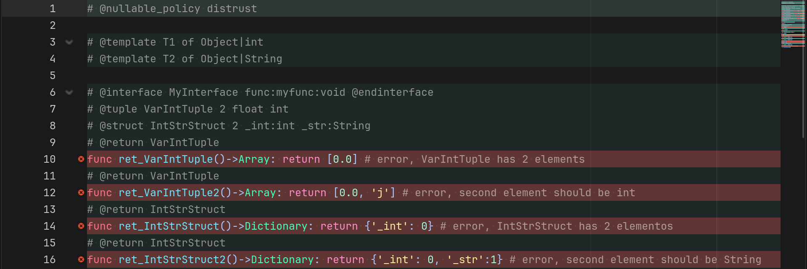
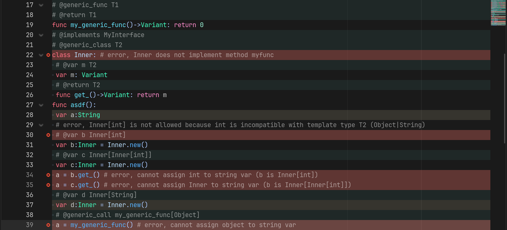
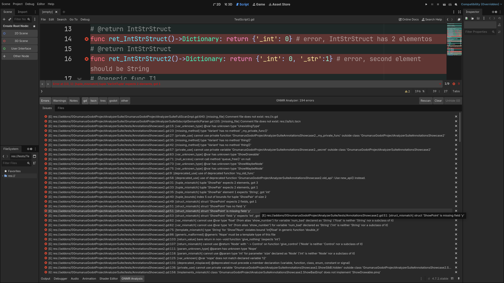

# Gnumarus Godot Project Analyzer Suite

Static analysis for Godot 4 GDScript that catches null errors,
broken contracts and type mismatches **before runtime** — declared
in plain comments, so your code stays 100% vanilla GDScript.
Ships with a realtime editor plugin (errors and warnings as you
type) and a headless pipeline (CI-friendly, ~1200 self-checks).





No code changes required: every annotation lives in a `#` comment.
Delete the comments and the project is untouched.

## Editor addon

Install from Project → Plugins and open any script:

- Errors and warnings inline in a status bar above the script status
  bar, with prev/next navigation (`<`/`>`), red/amber line
  highlights in Godot's own theme colors, and a hotkey
  (`Ctrl+Shift+Alt+F5`) for on-demand runs.
- Realtime with debounce, plus a deferred repaint that survives
  Godot's own validator pass. Repeat runs on unchanged buffers
  refresh only when a dependency changed (marked `(deps)`).
- No scan starts by itself: enabling the plugin warms nothing up,
  and filesystem rescans only flag the live analysis dirty. Scans
  run only on request, in a single WorkerThreadPool task (one scan
  at a time; realtime analysis pauses while it runs), so the editor
  never freezes.
- Project → Tools → Gnumaru's Full Scan (or File → Run on the
  `GnumarusGodotProjectAnalyzerSuiteFullScan` script) runs every
  analysis pass over the whole project and merges all errors and
  warnings into `.godot/0GnumarusGodotProjectAnalyzerSuiteData/ScanResults.json`.
  From the Tools menu it runs in the background pool (same
  exclusive mode as the warm pass); File → Run stays synchronous.
  The resource pass also analyzes GDScript embedded in `.tscn`/`.tres`
  (per-node user JSONs, opt out via `gnumarus_analyzer/analyze_embedded_scripts`).
- A bottom-panel dock with Issues and Files tabs: every known
  issue with severity toggles (errors / warnings / future notes)
  and per-type toggles (`gd`, `tscn`, `tres`, `godot`, other);
  picking a row jumps to it and reveals the right workspace
  (Script for scripts; embedded rows open the scene, focus the node
  and open its script at the error line). The Files tab shows the project inventory
  in Table and Text views, each split into files-only and
  directories-only listings (own addons toggle, sort and order per listing).
- Broken resource refs (`preload`/`load`/`extends`/`@icon`) are
  rechecked live on open, edit and save — no full scan needed.

## Annotations

| Annotation | What it buys you |
|---|---|
| `@var` / `@param` / `@return` | Refine any declaration with unions (`Node\|null`), narrowing, generics; contradictions and mismatches error |
| `@notnull` / `@nullable` markers | Per-slot never-null / watch-me contracts on any of the above |
| `@tuple` / `@struct` | Fixed-shape `Array`/`Dictionary` refinements with literal checking (length, keys, per-element types) |
| `@alias` | Named reusable type expressions, nullable included |
| `@template` / `@generic_class` | File-local type variables, bounds, per-call instantiation, generic classes |
| `@generic_func` / `@generic_call` | Method-level type parameters with explicit call-site binding (`f[int]`), checked args/slots |
| `@interface` / `@implements` | Structural blueprints with conformance checking |
| `@private` | Family-only members; outside uses error, cross-file included |
| `@deprecated` | Uses warn — functions, signals, consts, enums, classes, cross-file included |

## Nullability without the fear

`null` is a first-class union arm (`Node|null`); the analyzer tracks
it through guards (`==`/`!=`, `typeof`, `is`, bare truthiness,
`while`, `match`, `elif` chains, guard clauses), assignments
(`x = null` poisons later uses, reseats clear it) and call results
(`@return nullable` taints downstream, through member calls,
lambdas and across files).

Two policies, your call: **trust** (Godot-like leniency, default)
or **distrust** (unguarded nullable use warns), with an extra
**strict** mode for untyped slots. Set globally via Project
Settings, per file with a header tag, per slot with a marker —
migrating file-by-file is the intended path:

```gdscript
# @nullable_policy distrust
extends Node

func f(n: Node) -> void:
    n.queue_free() # WARNING: implicitly nullable 'Node'
    if n == null:
        return
    n.queue_free() # OK: guard clause proves non-null
```

## Cross-file intelligence

Referencing a class you never opened just works: a project-wide
class roster (engine cache + source scan) resolves names, missing
dependencies are analyzed on demand (cycles and depth guarded),
inheritance is followed through parent chains — including inner
classes (`Outer.Inner`) and quoted `extends "res://..."` bases —
and boundary calls are checked both ways (passing maybe-null into
an unsuspecting callee warns at the argument).

## Verify it yourself

```sh
./addons/0GnumarusGodotProjectAnalyzerSuite/tests/test.sh
```

Runs every suite headlessly (~1200 checks, green only on zero
failures, zero crashes). `tests/AnnotationsStressTest.gd` shows
every annotation valid and broken in one Godot-parseable file.

Full technical documentation (pipeline stages, every rule and
error kind, data layout, gaps): [`addons/0GnumarusGodotProjectAnalyzerSuite/README.md`](addons/0GnumarusGodotProjectAnalyzerSuite/README.md).

## Shameless Plug

If you're interested, check out my opengl 2 driver for godot 4:

[GLES2 on Godot 4](https://github.com/Gnumaru/godot/tree/_gles2_compatibility_driver_godot_4)

or my yet unreleased game on steam:

[Ezra's Legacy](https://store.steampowered.com/app/1454130/Ezras_Legacy/)